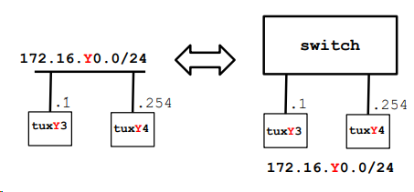
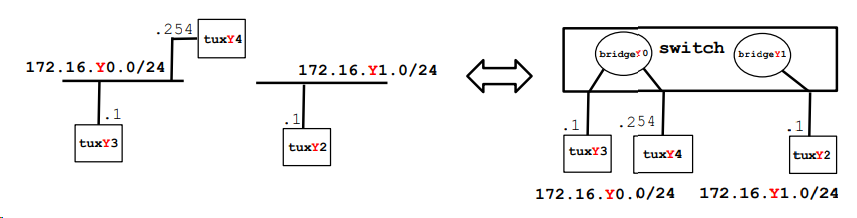
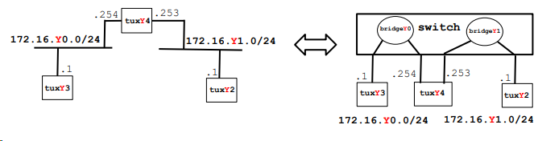
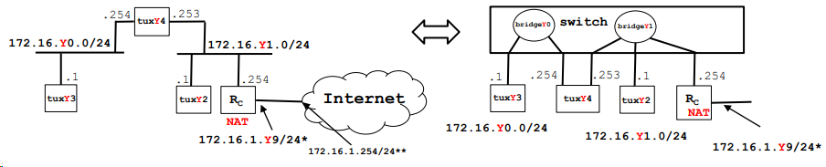
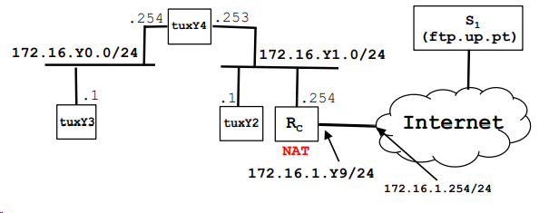
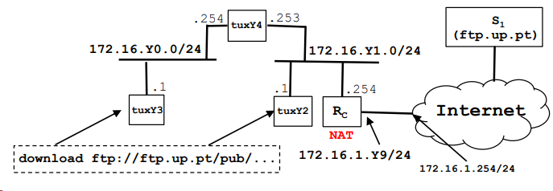

# Lab 2 - Redes de Computadores

## Índice
- [Parte 1 - FTP Downloader](#parte-1---ftp-downloader)
- [Parte 2 - Configuration and Study of a Network](#parte-2---configuration-and-study-of-a-network)
    - [Limpar configurações](#limpar-configurações)
    - [Experiência 1 - Configure an IP Network](#experiência-1---configure-an-ip-network)
    - [Experiência 2 - Implement two bridges in a switch](#experiência-2---implement-two-bridges-in-a-switch)
    - [Experiência 3 - Configure a Router in Linux](#experiência-3---configure-a-router-in-linux)
    - [Experiência 4 - Configure a Commercial Router and Implement NAT](#experiência-4---configure-a-commercial-router-and-implement-nat)
    - [Experiência 5 - DNS](#experiência-5---dns)
    - [Experiência 6 - TCP connections](#experiência-6---tcp-connections)
## Parte 1 - FTP Downloader

## Parte 2 - Configuration and Study of a Network

***Nota**: Estas experiências foram executadas na bancada 2, pelo que os nomes dos computadores (Tux21, Tux22, ...) serão relativos à bancada de cada um (bancada Y - TuxY1, TuxY2, ...).*

### Limpar configurações
Para iniciar as experiências, deveremos primeiro limpar as configurações do switch.
Para isto, teremos de ligar a porta S0 do Tux23, por exemplo, à porta T3, e a porta *Switch Console* à porta T4. Desta forma, esse computador terá acesso ao terminal do Switch.
Depois, abrimos o GTKterm, na porta /dev/ttyS0 e alteramos o *baudrate* para 115200, e pressionamos Enter, para termos acesso ao terminal.
Por fim, a seguinte sequência de comandos reiniciará a configuração do switch, para darmos início às experiências.
```bash
admin
/system reset-configuration
y
```

### Experiência 1 - Configure an IP Network
O objetivo desta experiência consiste na configuração dos endereços IP dos computadores Tux23 e Tux24, ligados a um switch.
Após a configuração, pretende-se averiguar o funcionamento do protocolo ARP, nomeadamente quando se eliminam os endereços configurados nas tabelas ARP.

<p align='center'>
    <br>
    Imagem 1
</p>

1. #### Disconnect the switch from netlab (PY.1). Connect tuxY3 and tuxY4 to the switch
Este passo inicial consiste em desconectar o switch da entrada P2.1, e posteriormente conectar as portas E0 do Tux23 e Tux24 nas portas 1 e 2 do switch. 
Devemos verificar sempre que a luz das portas acendeu, mostrando que o cabo está corretamente ligado.

2. #### Configure tuxY3 and tuxY4 using ifconfig and route commands
Seguindo a imagem fornecida pelo guião (Imagem 1), vemos que teremos de associar os endereços `172.16.20.1/24` ao Tux23 e `172.16.20.0.254/24` ao Tux24.
Para isto, iremos ao terminal e executaremos estes comandos:
- No Tux23:
```bash
ifconfig eth0 up
ifconfig eth0 172.16.20.1/24
``` 
- No Tux24:
```bash
ifconfig eth0 up
ifconfig eth0 172.16.20.254/24
``` 

3. #### Register the IP and MAC addresses of network interfaces
Para registar os endereços MAC, executaremos ```ifconfig``` no terminal, em cada um dos computadores que acabámos de usar, e os endereços MAC estarão na entrada ```ether``` do output.

4. #### Use ping command to verify connectivity between these computers
Para verificar que a ligação foi corretamente estabelecida, deveremos executar ```ping 172.16.20.1``` (Tux24) e ```ping 172.16.20.254``` (Tux23). 
Estes comandos irão, inicialmente, gerar pacotes ARP. Quando encontrarem o endereço MAC da máquina de destino, enviarão pacotes do tipo ICMP (Internet Control Message Protocol) para transferência de informação.

5. #### Inspect forwarding (route -n) and ARP (arp -a) tables
Usando o comando ```route -n```, no Tux23, receberemos um output que associa o endereço IP à porta correspondente.
Posteriormente, o comando ```arp -a``` mostrar-nos-á o endereço MAC correspondente a esse mesmo endereço IP.
Output:
```bash
?(172.16.50.254) at 00:21:5a:c3:78:70 [ether] on eth0
```

6. #### Delete ARP table entries in tuxY3 (arp -d ipaddress)
Neste passo, executaremos o comando ```arp -d 172.16.20.254/24``` para apagarmos da tabela ARP a entrada correspondente a este endereço IP.
Para verificação, se executarmos ```arp -a``` novamente, o output será vazio.

7. #### Start Wireshark in tuxY3.eth0 and start capturing packets
Teremos de abrir o Wireshark - será aqui que veremos os pacotes que são enviados e recebidos.

8. #### In tuxY3, ping tuxY4 for a few seconds
Executando ```ping 172.16.20.254/24``` no Tux23, os pacotes que são enviados estarão representados nos logs do Wireshark.

9. #### Stop capturing packets
```ctrl + C``` no terminal.

10. #### Save the log and study it at home
(Logs do Wireshark).

### Experiência 2 - Implement two bridges in a switch
O objetivo desta experiência consiste na implementação de duas *bridges* no switch, criando assim duas LANs (Local Area Network).

<p align='center'>
    <br>
    Imagem 2
</p>

1. #### Connect and configure tuxY2 and register its IP and MAC addresses
Conforme a imagem indica, teremos de configurar o Tux22 no endereço IP `172.16.21.1`.
Para isso, teremos de ligar a porta E0 do Tux22 ao switch, e nesse computador executaremos os seguintes comandos:
```bash
ifconfig eth0 up
ifconfig eth0 172.16.21.1/24
ifconfig eth0
```
Este último comando servirá para verificar se o endereço ficou corretamente configurado - o output deverá conter o endereço correto, e teremos de registar o endereço MAC que estará na entrada `ether` do output.

2. #### Create two bridges in the switch: bridgeY0 and bridgeY1
Observando a imagem, vemos que a bridge20 conterá o Tux23 e Tux24, e a bridge21 conterá apenas o Tux22.
Assim, criaremos as duas bridges com os seguintes comandos:
```bash
/interface bridge add name=bridge20
/interface bridge add name=bridge21
```

3. #### Remove the ports where tuxY3, tuxY4 and tuxY2 are connected from the default bridge (bridge) and add them the corresponding ports to bridgeY0 and bridgeY1
Para eliminar as portas que estão, por defeito, ligadas nos computadores, executaremos os seguintes comandos:
```bash
/interface bridge port remove [find interface=ether1]
/interface bridge port remove [find interface=ether2]
/interface bridge port remove [find interface=ether3]
```
E para terminar a configuração das bridges, usaremos os seguintes comandos.
```bash
/interface bridge port add bridge=bridge20 interface=ether1
/interface bridge port add bridge=bridge20 interface=ether2
/interface bridge port add bridge=bridge20 interface=ether3
```
Para verificar se as bridges foram corretamente implementadas, usaremos o seguinte comando:
```bash
/interface bridge port print
```

4. #### Start the capture at tuxY3.eth0
No Tux23, abriremos o Wireshark para fazer a captura dos pacotes para os seguintes passos.

5. #### In tuxY3, ping tuxY4 and then ping tuxY2
Ainda no Tux23, usaremos os seguintes comandos para fazer ping do Tux24 e Tux22, respetivamente. 
***Nota**: Deveremos observar os logs do Wireshark após cada ping, para verificar se os pacotes estão a ser corretamente enviados.*
```bash
ping 172.16.20.254
ping 172.16.21.1
```

Conclui-se que o ping em Tux24 foi corretamente efetuado, mas não no Tux22. Isto deve-se ao facto de o primeiro estar ligado ao Tux23 pela bridge20, mas o segundo encontra-se numa bridge diferente, logo não há forma de fazer a ligação.

6. #### Stop the capture and save the log
```ctrl + C```
(Logs do Wireshark).

7. #### Start new captures in tuxY2.eth0, tuxY3.eth0, tuxY4.eth0
Executar os seguintes comandos em cada um dos computadores:
```bash
ping 172.16.20.255
ping 172.16.21.255
```


8. #### In tuxY3, do ping broadcast (ping -b 172.16.Y0.255) for a few seconds
Autoexplicativo

9. #### Observe the results, stop the captures and save the logs
(Logs do Wireshark).

10. #### Repeat steps 7, 8 and 9, but now do ping broadcast in tuxY2 (```ping -b 172.16.Y1.255```)
Autoexplicativo.


### Experiência 3 - Configure a Router in Linux
O objetivo desta experiência será usar o Tux24 como router, usando as bridges criadas anteriormente, para que os computadores Tux22 e Tux23 possam comunicar entre si.
O Tux24 servirá como *gateway*.

<p align='center'>
    <br>
    Imagem 3
</p>


1. #### Transform tuxY4 (Linux) into a router
Como a porta E0 do Tux24 já foi configurada, teremos de usar a E1.
Para isso, ligaremos essa porta a uma nova entrada do switch, e teremos de configurar o endereço IP usando os seguintes comandos:
```bash
ifconfig eth1 up
ifconfig eth1 172.16.21.253/24
```
Agora, teremos de ligar esta porta à bridge21. Desta forma, o Tux23 está ligado pela bridge20 ao Tux24, que por sua vez estará ligado pela bridge21 ao Tux22, desta forma assegurando a comunicação entre os três computadores.
Primeiro, teremos de eliminar as portas às quais o Tux24 está ligado por defeito, e adicionar a nova porta, usando os seguintes comandos:

```bash
/interface bridge port remove [find interface=ether4]
/interface bridge port add bridge=bridge21 interface=ether4
```

Por fim, ainda no Tux24, teremos de ativar IP forwarding e ativar ICMP, usando os seguintes comandos:

```bash
echo 1 > /proc/sys/net/ipv4/ip_forward
echo 0 > /proc/sys/net/ipv4/icmp_echo_ignore_broadcasts
```

2. #### Observe MAC addresses and IP addresses in tuxY4.eth0 and tuxY4.eth1
Para este passo, usaremos o comando ```ifconfig``` no Tux24 para registar os endereços IP e MAC de ```eth0``` e ```eth1```.

3. #### Reconfigure tuxY3 and tuxY2 so that each of them can reach the other
Neste passo, teremos de usar comandos ```route``` para que o Tux22 e Tux23 tenham accesso ao router. 
Como podemos ver pela imagem, o Tux22 está ligado ao Tux24 por ```172.16.21.0/24``` e o Tux23 está ligado ao Tux24 por ```172.16.20.0/24```, e o Tux24 está nas portas 253 e 254 destes endereços, respetivamente.
A configuração que faremos, para cada um dos computadores, terá em consideração o endereço que pretendemos aceder, e a porta onde o Tux24 se encontra no endereço atual.
Logo, os comandos a utilizar serão:
- Tux22:
```bash
route add -net  172.16.20.0/24 gw 172.16.21.253
```
- Tux23:
```bash
route add -net  172.16.21.0/24 gw 172.16.21.254
```

4. #### Observe the routes available at the 3 tuxes (route -n)
Para verificar se as rotas foram bem configuradas, usaremos o comando ```route -n```.

5. #### Start capture at tuxY3
Abrir o Wireshark no Tux23 para os passos seguintes.

6. #### From tuxY3, ping the other network interfaces (172.16.Y0.254, 172.16.Y1.253, 172.16.Y1.1) and verify if there is connectivity
Executar os seguintes comandos:
```bash
ping 172.16.20.254
ping 172.16.20.253
ping 172.16.20.1
```
Se estiver tudo feito corretamente até agora, os pings devem estar representados no Wireshark.

7. #### Stop the capture and save the log
(Logs do Wireshark).

8. #### Start capture in tuxY4; use 2 instances of Wireshark, one per network interface
Abrir duas janelas do Wireshark, uma para o `eth0` e uma para o `eth1`.

9. #### Clean the ARP tables in the 3 tuxes
- Tux22:
```bash
arp -d 172.16.21.253
```
- Tux23:
```bash
arp -d 172.16.20.254
```
- Tux24:
```bash
arp -d 172.16.20.1
arp -d 172.16.21.1
```
Isto eliminará as tabelas ARP do Tux24, no Tux22 e no Tux23, e dos Tux22 e Tux23, no Tux24.

10. #### In tuxY3, ping tuxY2 for a few seconds.
No Tux23, executar o seguinte comando:
```bash
ping 172.16.21.1
```
Isto acederá ao Tux22 através do router Tux24.

11. #### Stop captures in tuxY4 and save logs
```ctrl + C```

(Logs do Wireshark).


### Experiência 4 - Configure a Commercial Router and Implement NAT
O objetivo desta experiência é ligar um router comercial à rede previamente criada. Iremos adicionar à bridge21 esse router, com NAT configurado, de modo a que todos os computadores tenham acesso à internet. 

<p align='center'>
    <br>
    Imagem 4
</p>

1. #### Connect ether1 of RC to the lab network on PY.1 (with NAT enabled by default) and ether2 of RC to a port on bridgeY1. Configure the IP addresses of RC through the router serial console
No primeiro passo, teremos de ligar a porta E1 do router comercial à porta 2.1 da régua, e a porta E2 do router ao switch.
Para adicionar o RC à bridge21, teremos primeiro de eliminar as portas onde ele está ligado por defeito.
Para isso, executaremos os seguintes comandos:

```bash
/interface bridge port remove [find interface=ether5]
/interface bridge port add bridge=bridge21 interface=ether5
```

Agora teremos de limpar as configurações do router.
Para isso, inicialmente teremos de trocar o cabo que está ligado à Switch Console, e ligá-lo ao Router MT, e executar o seguinte comando:

```bash
/system reset-configuration
```

Ainda na no terminal do GTKterm, iremos configurar os endereços IP do router, usando os seguintes comandos:

```bash
/ip address add address=172.16.1.59/24 interface=ether1
/ip address add address=172.16.21.254/24 interface=ether2
```

2. #### Verify routes (tuxY4 as default router of tuxY3; RC as default router for tuxY2 and tuxY4; in tuxY2 and RC add routes for 172.16.Y0.0/24)
Usando comandos `route`, iremos configurar as rotas *default* de cada computador.
- Tux22:
```bash
route add default gw 172.16.21.25[3/4?]
```
- Tux23:
```bash
route add default gw 172.16.20.254
```
- Tux24:
```bash
route add default gw 172.16.21.254
```
- Router console:
```bash
/ip route add dst-address=172.16.50.0/24 gateway=172.16.51.253
/ip route add dst-address=0.0.0.0/0 gateway=172.16.1.254
```

3. #### Using ping commands and Wireshark, verify if tuxY3 can ping all the network interfaces of tuxY2, tuxY4 and RC
No Tux23, iremos abrir o Wireshark e fazer ping de todas as interfaces, todas deverão funcionar.

```bash
ping 172.16.20.254
ping 172.16.21.1
ping 172.16.21.254
```

4. #### In tuxY2

- Executar os comandos
```bash
sysctl net.ipv4.conf.eth0.accept_redirects=0
sysctl net.ipv4.conf.all.accept_redirects=0
```

- Remover a rota até 172.16.20.0/24 via Tux24
```bash
route del -net 172.16.50.0 gw 172.16.51.253 netmask 255.255.255.0
```

- No Tux22, *pingar* Tux23 e analisar o caminho que os pacotes ICMP ECHO e ECHO-REPLY seguem (olhar para os endereços MAC)
```bash
ping 172.16.50.1
```
A ligação é estabelecida, usando o Rc como router ao invés do Tux24
(Logs do Wireshark).

- Executar traceroute em Tux22 para Tux23
```bash
traceroute -n 172.16.20.1
> traceroute to 172.16.20.1 (172.16.20.1), 30 hops max, 60 byte packets
> 1  172.16.21.254 (172.16.21.254)  0.200 ms  0.204 ms  0.224 ms
> 2  172.16.21.253 (172.16.21.253)  0.354 ms  0.345 ms  0.344 ms
> 3  tux21 (172.16.50.1)  0.596 ms  0.587 ms  0.575 ms
```
Verifica-se que a ligação passa pelo router em Tux24.

- Adicionar novamente em Tux22 a rota que liga a Tux24
```bash
route add -net 172.16.20.0/24 gw 172.16.21.253
```

Voltando a executar `traceroute`, verificamos o seguinte output:
```bash
traceroute -n 172.16.20.1
> traceroute to 172.16.20.1 (172.16.20.1), 30 hops max, 60 byte packets
> 1  172.16.21.253 (172.16.21.253)  0.196 ms  0.180 ms  0.164 ms
> 2  tux51 (172.16.20.1)  0.414 ms  0.401 ms  0.375 ms
```
A ligação já não passa por Tux24, como voltámos a adicionar a rota anterior.

- Activate the acceptance of ICMP redirect at tuxY2 when there is no route to 172.16.Y0.0/24 via tuxY4 and try to understand what happens
```bash
sysctl net.ipv4.conf.eth0.accept_redirects=1
sysctl net.ipv4.conf.all.accept_redirects=1
```
(Verificar resultados).

5. #### In tuxY3, ping the router of the lab I.321 (172.16.1.254) and try to understand what happens
No Tux23, executaremos o seguinte comando para verificar a ligação:

```bash
ping 172.16.1.254 // sala I.321
ping 172.16.2.254 // sala I.320
```

6. #### Disable NAT functionality in router RC
```bash
/ip firewall nat disable 0
```

7. #### In tuxY3 ping 172.16.1.254, verify if there is connectivity, and try to understand what happens
Iremos fazer ping do router do lab novamente, usando o seguinte comando:

```bash
ping 172.16.1.254 // sala I.321
ping 172.16.2.254 // sala I.320
```
Desta vez, verifica-se que não há ligação por termos desativado o NAT, que se encontrava ativado por defeito.
Por isso, teremos de o reativar, usando o seguinte comando:

```bash
/ip firewall nat disable 0
```


### Experiência 5 - DNS
O objetivo desta experiência é configurar o DNS dentro da rede configurada até agora, para poder aceder a websites da internet através do seu nome de domínio.

<p align='center'>
    <br>
    Imagem 5
</p>

1. #### Configure DNS at tuxY3, tuxY4, tuxY2 (use DNS server services.netlab.fe.up.pt (172.16.1.1))
Inicialmente, teremos de configurar o DNS em cada um dos computadores. Para isso, teremos de substituir o conteúdo do ficheiro `/etc/resolv.conf` em cada um deles, e escrever um dos seguintes comandos, dependendo da sala:

```bash
nameserver 172.16.1.1 // sala I.321
nameserver 172.16.2.1 // sala I.320
```

2. #### Verify if names can be used in these hosts (e.g., ping hostname, use browser)
Para testar se o DNS foi corretamente configurado, executaremos o seguinte comando no terminal:

```bash
ping google.com
```

Isto tentará aceder ao website da internet cujo nome de domínio é `google.com`, e se tudo até agora estiver corretamente configurado, o *ping* irá funcionar.

3. #### Execute ping (new-hostname-in-the-Internet); observe DNS related packets in Wireshark
(Logs do Wireshark).

### Experiência 6 - TCP connections

<p align='center'>
    <br>
    Imagem 6
</p>

1. #### Compile your download application in tuxY3
Inicialmente, teremos de executar o Makefile que criámos, no computador Tux23, para compilar a aplicação de download.

2. #### In tuxY3, restart capturing with Wireshark and run your application
Após abrir o Wireshark, temos de executar a aplicação e tentar descarregar um ficheiro.

3. #### Verify if file has arrived correctly, stop capturing and save the log
Se o ficheiro for corretamente descarregado, a aplicação e toda a configuração de rede estão corretas.

(Logs do Wireshark).

(Ficheiro).

4. #### Using Wireshark, observe packets exchanged including:
    - TCP control and data connections, and its phases (establishment, data, termination)
    - Data transferred through the FTP control connection
    - TCP ARQ mechanism
    - TCP congestion control mechanism in action
    - Note: use also the Wireshark Statistics tools (menu) to study the TCP phases, ARQ and congestion control mechanism
(Logs do Wireshark).

5. #### Repeat the download in tuxY3 but now, in the middle of the transfer, start a new download in tuxY2. Use the Wireshark statistics tools to understand how the throughput of a TCP connection varies along the time

Para testar melhor a execução da aplicação, iremos executar a aplicação no Tux23, e a meio da transferência iremos ao Tux22 para executar também.
(Logs do Wireshark).
